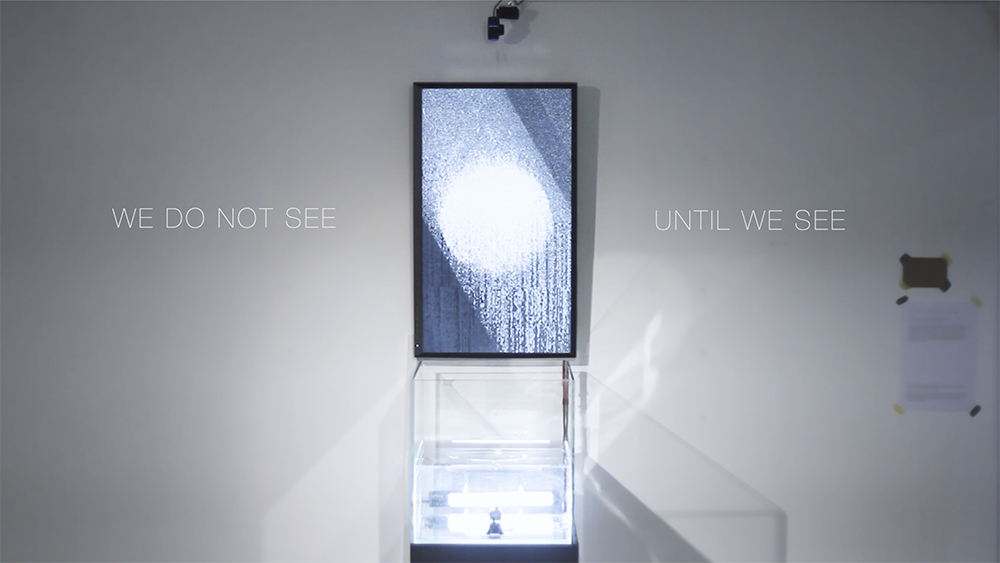
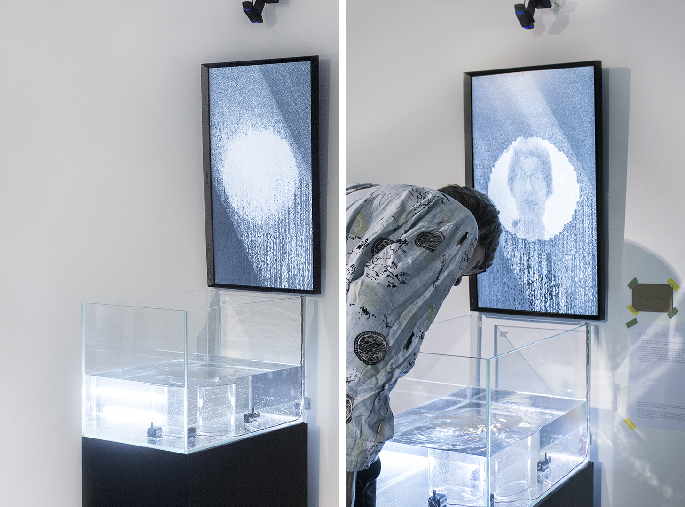
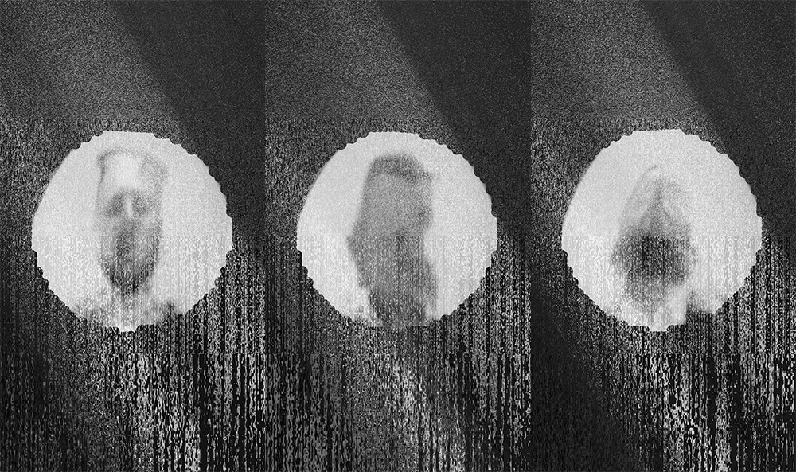

# We do not See Until We See

The flow would not be perceived clearly until we seeing ourselves under its influence.

Videos and project details please check [PROJECT PAGE HERE](https://bingcomputing.hotglue.me/?wedonotseeuntil)

-

2019

Interactive Installation

#OpenFrameworks #Arduino

-

We do not See Until We See is an analog and digital interactive installation, an abstraction of the state of how we perceive matters around us. A tank with unnoticeably flowing water and a mirror at the centre, and a screen against the tank displaying live-generated digital abstract flow construct a symmetrical scene. When there is a viewer looks straight into in the mirror within the tank, his/her reflected face captured by the webcam above would trigger the system, then he/she would see the flow getting more noticeable, eventually distorting his/her reflected image. Meanwhile, the surrounding audience would also witness the flow from that viewer’s distorted image on the screen. The flow would not be perceived clearly until we seeing ourselves under its influence - Not only the flow of water in the tank, but also the flow of politics, culture, ecosystem etc.

Addon required: [ofxFaceTracker](https://github.com/kylemcdonald/ofxFaceTracker)
